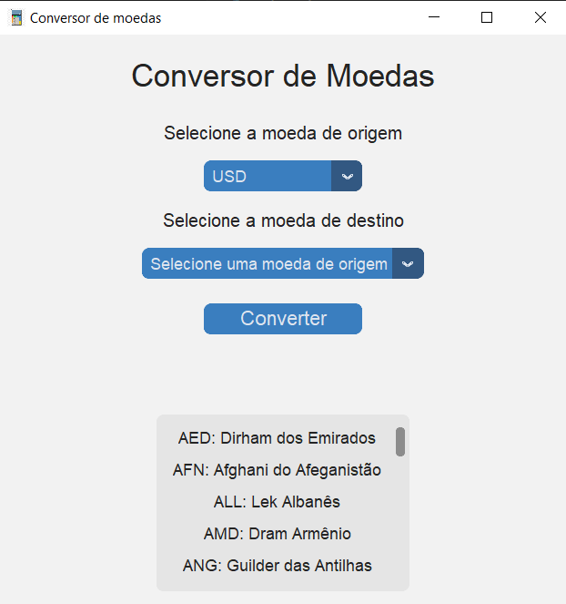

# Conversor de Moedas 

## Lógica de programação

### Funcionalidades

- Escolha da moeda de origem e destino utilizando menus suspensos.
- Conversão entre moedas com base na cotação atual.
- Mostrar a taxa de câmbio da moeda convertida.
- Mostrar a taxa de transformação da moeda convertida.

### Instalação

Para realizar o projeto, é preciso ter o Python instalado. Além disso, é necessário ter as bibliotecas customtkinter, requests e xmltodict disponíveis. Para instalar essas dependências, utilize o pip.
 
    
### Pré-requisitos

- É necessário ter o Python 3.x instalado.
- Ter acesso à internet para consultar as cotações das moedas.
- Os arquivos moedas.xml e conversoes.xml devem estar no diretório do projeto
### Screenshots
!

### Aprendizados

Este projeto mostra como desenvolver uma aplicação de desktop básica para converter moedas usando o CustomTkinter. Alguns pontos de aprendizado abrangem:
        Conexão com APIs externas para obter taxas de câmbio.
Utilização do xmltodict para manipular XML e obter dados sobre moedas e conversões disponíveis.
       Implementação de uma GUI (Interface Gráfica do Usuário) simples com o CustomTkinter.
 
#### Autores: 

- Ana Carolina Constantino de Oliveira - N°02
- Isabelly Martins Zamperim - N°29
- Maria Clara Andrade Pereira - N°31
- Letícia de Oliveira Missias - N°33

